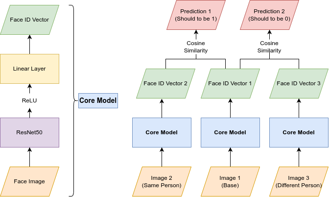

# Face Identifier

## Info

This module includes two CNN models: `FaceDetector` and `FaceIdentifier`.

The detector aims to detect face in a given image and return the bounding box, the output format is `[has_face, x1, y1, x2, y2]`. A `CropFace` transformation wrapping the detector is also implemented.

The identifier returns a vector(face re-ID) after reading a face image.

## Dataset

The training and evaluation are based on [CelebA Dataset](https://mmlab.ie.cuhk.edu.hk/projects/CelebA.html) .

## Usage

### Face re-ID

```python
from face_identifier.models import FaceIdentifier

model = FaceIdentifier.load("face-identifier-no-cropped.pt")
face_id = model(images_tensor)
```

### Face Detection

```python
from face_identifier.models import FaceDetector

model = FaceDetector.load("face-detector.pt")
predictions = model(images_tensor)  # every row is [has_face, x1, y1, x2, y2]
```

### Face Cropping

```python
from face_identifier.models import FaceDetector
from face_identifier.transforms import CropFace

cropper = CropFace(FaceDetector.load("face-detector.pt"))
images_cropped = cropper(images_tensor)
```

### Cropped Face re-ID

You can also combine the `FaceCrop` and the `Face-Identifier` to improve the performance.
```python
from torch import nn
from face_identifier.models import FaceIdentifier, FaceDetector
from face_identifier.transforms import CropFace

model = nn.Sequential(
    CropFace(FaceDetector.load('face-detector.pt')),
    FaceIdentifier.load("face-identifier-cropped.pt"),
)
face_id = model(images_tensor)
```


## Training

We can train a `TripletModel` (without learnable parameters except of the core model) wrapping the `FaceIdentifier`, and the core model will learn to output the face vectors to distinguish face pictures from different people. You can refer the notebooks to train your own model.


